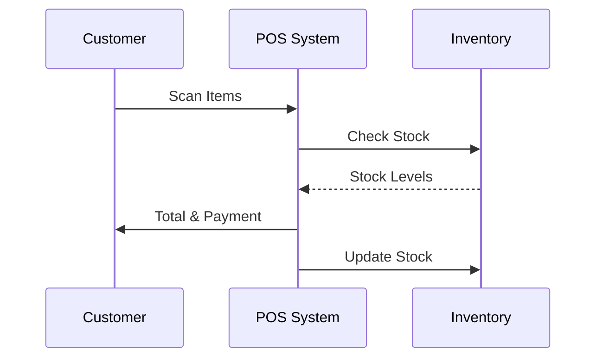

## Overview

Louis Lukkanit provides modular Laravel packages for CMS, POS, and business systems. You integrate these components into your Laravel applications to build robust features quickly. Start by installing via Composer, then configure routes and models for your needs.

This guide covers configuration, CMS implementation, POS setup, and business modules with practical examples.

<Callout kind="info">
  Ensure your Laravel app runs version 10+ for full compatibility.
</Callout>

## Installation and Configuration

Follow these steps to add Louis Lukkanit packages to your project.

<Steps>
  <Step title="Install Packages" icon="download">
    Use Composer to require the core packages.

    <CodeGroup tabs="CMS,POS,Business">
      ```bash
      composer require koamishin/ll-cms
      ```
      ```bash
      composer require koamishin/ll-pos
      ```
      ```bash
      composer require koamishin/ll-business
      ```
    </CodeGroup>
  </Step>

  <Step title="Publish Assets" icon="settings">
    Publish migrations, configs, and views.

    ```bash
````bash
php artisan vendor:publish --provider="Koamishin\LLCMS\LLCMSServiceProvider"
php artisan vendor:publish --provider="Koamishin\LLPOS\LLPOSServiceProvider"
````
    ```
  </Step>

  <Step title="Run Migrations" icon="database">
    Update your database schema.

    ```bash
    php artisan migrate
    ```
  </Step>
</Steps>

## Key Features Overview

Explore core capabilities with these feature cards.

<Columns cols={3}>
  <Card title="CMS Management" icon="book-open" href="#cms-features">
    Handle articles, pages, and media uploads seamlessly.
  </Card>

  <Card title="POS Transactions" icon="shopping-cart" href="#pos-setup">
    Process sales, inventory, and receipts in real-time.
  </Card>

  <Card title="Business Modules" icon="trending-up" href="#business-modules">
    Integrate CRM, invoicing, and reporting tools.
  </Card>
</Columns>

## Implementing CMS Features

Use the CMS package to manage content dynamically.

<Tabs>
  <Tab title="Articles Model" icon="file-text">
    Extend the base model for your articles.

    ```php
    <?php

    namespace App\Models;

    use Koamishin\LLCMS\Models\Article as BaseArticle;

    class Article extends BaseArticle
    {
        protected $fillable = ['title', 'slug', 'content', 'status'];
    }
    ```
  </Tab>

  <Tab title="Blade Component" icon="code">
    Render articles in your views.

    ```blade
    <x-ll-cms::article :article="$article">
        <div class="content">
            {!! $article->content !!}
        </div>
    </x-ll-cms::article>
    ```
  </Tab>
</Tabs>

<Callout kind="tip">
  Generate slugs automatically by adding `HasSlugs` trait to your model.
</Callout>

## Setting up POS Functionalities

Configure POS for point-of-sale operations.



<Steps>
  <Step title="Register Products" icon="package">
    Seed your database with products.

    ```php
    // database/seeders/ProductSeeder.php
    Product::create([
        'name' => 'Sample Widget',
        'price' => 29.99,
        'stock' => 100,
    ]);
    ```
  </Step>

  <Step title="Process Sale" icon="shopping-cart">
    Use the POS controller for transactions.
  </Step>
</Steps>

## Building Business System Modules

Create custom modules for CRM or invoicing.

<Expandable title="Advanced Module Configuration" default-open="false">
  Edit `config/ll-business.php` to enable modules:

  ```php
  return [
      'modules' => [
          'crm' => true,
          'invoicing' => true,
      ],
      'api_key' => env('LL_BUSINESS_API_KEY', 'your-api-key-here'),
  ];
  ```
</Expandable>

## Next Steps

<Columns cols={2}>
  <Card title="API Integration" icon="zap" href="/authentication">
    Secure your endpoints with auth.
  </Card>

  <Card title="Customization Guide" icon="settings" href="/configuration">
    Tailor components to your needs.
  </Card>
</Columns>